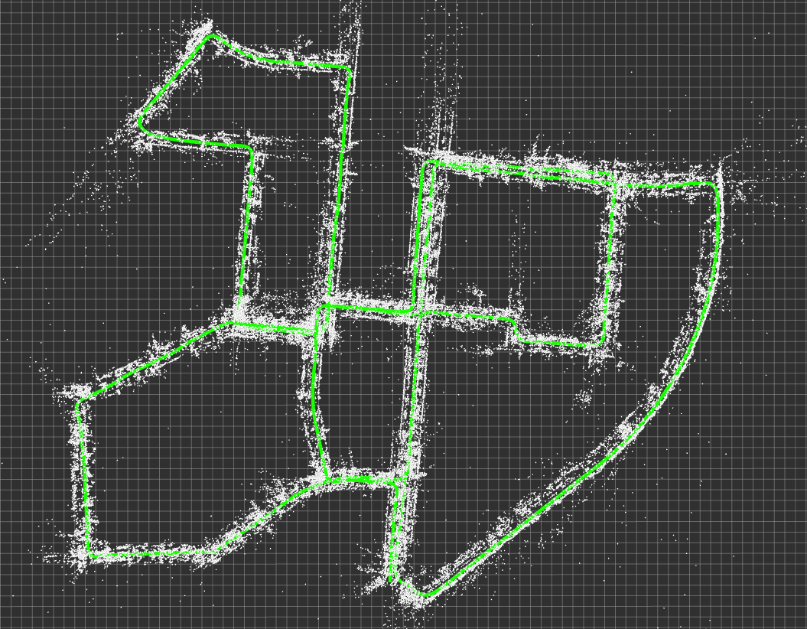

# LK-VIO

[](mailto:linzeshi@foxmail.com)
[](https://space.bilibili.com/22863858?spm_id_from=333.788.0.0)

一个简单的视觉SLAM项目。

- 前端: ORB+LK-Flow
- 后端: g2o
- 回环: DBoW2

main分支只有VO，developing分支有VIO。

VIO版本还没完全稳定，还在开发中。

## 实验结果 📈

### KITTI数据集

b站视频： [kitti_00](https://b23.tv/xFHpiMm)

在kitti00上跑，纯VO时间消耗如下：

```sh
[2024-03-16 23:51:54.863] [MineLog] [info] [/home/lin/Projects/lk-vio/node/offline_kitti_ros_node.cpp:59:59] Has processed 4500 frames.
[2024-03-16 23:51:54.863] [MineLog] [info] [/home/lin/Projects/lk-vio/node/offline_kitti_ros_node.cpp:60:60] Time Comsumed: 18.191437 ms, Average Time Consumed: 14.930101216270316 ms
```



前端+后端+回环，时间消耗如下：

```sh
[2024-03-17 00:02:50.250] [MineLog] [info] [/home/lin/Projects/lk-vio/node/offline_kitti_ros_node.cpp:59:59] Has processed 4500 frames.
[2024-03-17 00:02:50.250] [MineLog] [info] [/home/lin/Projects/lk-vio/node/offline_kitti_ros_node.cpp:60:60] Time Comsumed: 24.216882 ms, Average Time Consumed: 18.16421585418985 ms
```

.png)

## 安装 🛠️

该项目的依赖如下：

- ceres 1.14.0
- OpenCV 4.2.0
- **Eigen 3.4** **要维持所有库使用的版本相同，要不饶g2o运行时会崩溃"data not aligned"。也就是说，想用其他版本的Eigen，请修改所有库的Eigen依赖版本。**
- g2o
- DBoW2
- spdlog

### Ceres 1.14.0

```sh
 git clone https://github.com/ceres-solver/ceres-solver.git
 git checkout tags/1.14.0
 cd ceres-solver
 mkdir build
 cd build
 cmake ..
 make -j8
 sudo make install
```

### Opencv 4.2.0

```sh
mkdir opencv-4.2.0
cd opencv-4.2.0
wget https://github.com/opencv/opencv/archive/4.2.0.zip
unzip 4.2.0.zip
wget https://github.com/opencv/opencv_contrib/archive/4.2.0.zip
unzip 4.2.0.zip
mkdir build
mkdir install
cd build

cmake -DCMAKE_BUILD_TYPE=Release -DOPENCV_EXTRA_MODULES_PATH=/home/lin/Projects/opencv-4.2.0/opencv_contrib-4.2.0/modules  -DCMAKE_INSTALL_PREFIX=/home/lin/Projects/opencv-4.2.0/install -DBUILD_EXAMPLES=OFF ../opencv-4.2.0
make -j8
sudo make install
```

### g2o

必须先安装SuiteSparse和CHOLMOD，然后再编译g2o。要不然会报错如下：
over stackflow也有人遇到过这个问题，可以参考[这里](https://stackoverflow.com/questions/41882235/libg2o-linker-errors-on-os-x)。

```sh
in function `g2o::LinearSolverCSparse<Eigen::Matrix<double, 6, 6, 0, 6, 6> >::solvePattern(g2o::SparseBlockMatrix<Eigen::Matrix<double, -1, -1, 0, -1, -1> >&, std::vector<std::pair<int, int>, std::allocator<std::pair<int, int> > > const&, g2o::SparseBlockMatrix<Eigen::Matrix<double, 6, 6, 0, 6, 6> > const&)':
```

安装步骤

```sh
sudo apt-get install libsuitesparse-dev libcholmod3
cd thirdparty/g2o
mkdir build
cmake ..
make -j
```

### DBoW2

在`thirdparty/DBoW2`目录下，请修改CMakeLists.txt文件，将`set(OpenCV_DIR /home/lin/Projects/opencv-4.2.0/install/share/OpenCV)`改为自己的路径。

```sh
cd ../DBoW2
mkdir build
cd build
cmake ..
make -j
```

### spdlog

纯头文件版，在`thirdparty/spdlog`目录下，不用编译。

## 编译本项目

```sh
cd lk-vio
mkdir build && cd build
cmake ..
make -j
```

- 也可以在catkin_ws下编译

```sh
cd catkin_ws
cp -r lk-vio src/lk-vio
catkin_make
```

## 运行 Demo 🎬

运行需要带上`.json`参数文件。

```sh
./bin/offline_node_ros_kitti /home/lin/Projects/ssvio/config/config.json
```

- 如果想用roslanch，需要手动修改`launch/offline_kitti.launch`文件，修改`args`参数为你的`.json`文件路径。

```sh
roslaunch lk-vio offline_kitti.launch
```

## 更新计划 🗓️

- [ ] 更换LK-FLow为其他基于深度学习的光流估计方法 --> 目前用Opencv的`calcOpticalFlowPyrLK`，可视化查看时，发现有很多误匹配
- [ ] 添加IMU预积分 --> ORB-SLAM3的太复杂了，看不懂。在参考高博的书coding。
- [ ] 添加ROS的支持(Doing) --> 也不是为了做ROS，只是为了做可视化。Pangolin的资料太少了，搞了一堆bug出来。
- - [x] 点云可视化
- - [x] 位姿可视化
- - [x] 轨迹可视化
- - [x] 图片可视化

## 参考

- [Visual SLAM14 Lecture](https://github.com/gaoxiang12/slambook2)
- [A Simple Stereo SLAM System with Deep Loop Closing](https://github.com/Mingrui-Yu/A-Simple-Stereo-SLAM-System-with-Deep-Loop-Closing)
- [ORB-SLAM3](https://github.com/raulmur/ORB_SLAM3)
- [SSVIO](https://github.com/weihaoysgs/ssvio)
- [SAD Book](https://github.com/gaoxiang12/slam_in_autonomous_driving)

[](https://github.com/Nothand0212/lk_vio)
